<a href="https://github.com/DarkRewar/BaseTool"></a>
<a href="https://github.com/DarkRewar/BaseTool/tree/develop"></a>
<a href="unityhub://2021.3.37f1/3b6005ad5ad6"></a>


<a href="https://twitter.com/intent/follow?screen_name=darkrewar"></a>

# Description

BaseTool contains many features that improve your daily game development. 
Every features are grouped by modules and you can enable features you want to use.

It could be used for any kind of project, at any time, by *pretty* anyone. It contains those key features:

- a Todo List window to check you project state ;
- a singleton pattern to put on your MonoBehaviour ;
- the cooldown class to avoid wasting time reimplement it everywhere ;
- dictionaries that can be serialized in the inspector ;
- game event flow using ScriptableObject ;
- GetComponent attributes to retrieve components when you want ;
- movement and shooter features ;
- many editor attributes ;
- many class extensions (for Vector3, arrays, camera...) ;
- and many small but great features...

# Installation

This tool is made for the Unity package manager and is available for Unity 2021 LTS and further.

How to install:

- Go to `Window > Package Manager` ;
- Click the plus button-dropdown on the top-left of the window ;
- Select `Add package from git URL` ;
- Paste this URL : `https://github.com/DarkRewar/BaseTool.git`
- Or if you want to test the preview : `https://github.com/DarkRewar/BaseTool.git#develop`

# Documentation

1. [Core](#core)
    - [Setup Wizard](#setup-wizard)
    - [Dev Console](#dev-console)
    - [Injector](#injector)
    - [Cooldown](#cooldown)
    - [MonoSingleton](#monosingleton)
    - [ValueListener](#valuelistener)
    - [SerializableDictionary](#serializabledictionary)
    - [GameEvent](#game-events)
    - [Class Extensions](#class-extensions)
    - [Math Utils](#math-utils)
    - [TickManager](#tickmanager)
    - [Tree](#tree)
    - [Interfaces](#core-interfaces)
2. [Movement](#movement)
    - [Components](#movement-components)
    - [Interfaces](#movement-interfaces)
3. [Shooter](#shooter)
    - [Sample](#shooter-sample)
    - [Components](#shooter-components)
    - [Interfaces](#shooter-interfaces)
    - [Weapon](#weapon)
4. [RPG](#rpg) [WIP]
5. [Roguelite](#roguelite) [WIP]
6. [UI](#ui)
    - [Workflow](#ui-workflow)
    - [View](#view)
    - [Navigation](#navigation)
    - [Sample](#ui-sample)
7. [Editor](#editor)
    - [Todo List](#todo-list)
    - [MinMaxAttribute](#minmaxattribute)
    - [IfAttribute](#ifattribute)
    - [IfNotAttribute](#ifnotattribute)
    - [ReadOnlyAttribute](#readonlyattribute)
    - [MessageAttribute](#messageattribute)
    - [ButtonAttribute](#buttonattribute)

## Core

### Setup Wizard

By default, BaseTool include every modules in the project. Each module is an Assembly which can be enabled or disabled using the setup wizard.

To open the setup wizard, go to the topbar and open `Window > BaseTool > Setup`.

`Core` is the main module which is mandatory to let BaseTool work. Other modules are all optional. If you only want essential features, untick every modules.

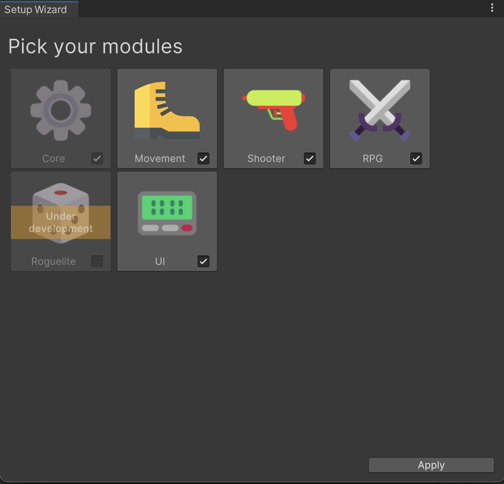

### Dev Console

You can add/remove you own command to the `Console` by using :

```csharp
BaseTool.Console.AddCommand("<command>", "<description>", MethodCallback);

BaseTool.Console.RemoveCommand("<command>");
```

Here is an implementation inside a `MonoBehaviour`:

```csharp
using BaseTool;

public class AddCustomCommand : MonoBehaviour
{
    public void OnEnable()
    {
        Console.AddCommand("<my-command>", "<description>", Callback);
    }
    
    public void OnDisable()
    {
        Console.RemoveCommand("<my-command>");
    }

    private void Callback(ConsoleArguments args)
    {
        Console.Write($"Callback command with {args}");
    }
}
```

The command callback passes a `ConsoleArguments` as parameter. 
This is an handler to parse arguments from the command.

For example, the command `mycommand test 99 -h -number 123` will 
parse arguments like : 

```csharp
args[0]; // test
args[1]; // 99
args["h"]; // null
args["number"]; // 123

// You can check if an argument exists
args.Exists("h"); // true
```

Since 0.4.0, dev console requires a `ConsoleSettings` file to
work. This asset contains definitions to change the toggle key
code, the time scale when opened and its inclusion in build.

Currently, this file **must** be in the `Resources` folder and
be named `ConsoleSettings`.

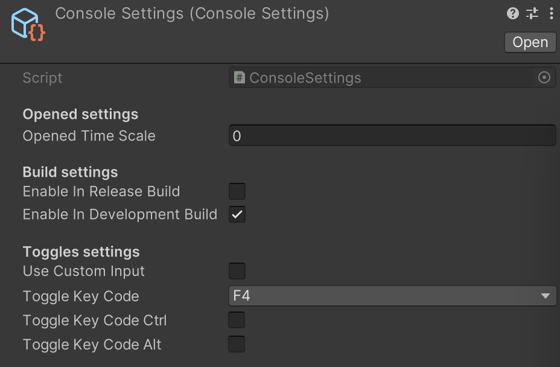

By default, to toggle the dev console, press F4 key.


### Injector

You can "automatically" retrieve your components by using the `Injector.Process()` method.

To get your `Awake()`, `OnEnable()`, `Start()` or anything else clean, you can add attributes upon fields and properties you want to retrieve. You can use one of those five attributes following their exact method:
- `GetComponent`
- `GetComponents`
- `GetComponentInChildren`
- `GetComponentsInChildren`
- `GetComponentInParent`

```csharp
using BaseTool;
using UnityEngine;

[RequireComponent(typeof(Rigidbody))]
public class MyComponent : MonoBehaviour
{
    [GetComponent, SerializeField]
    private Rigidbody _rigidbody;

    [GetComponent]
    public Rigidbody Rigidbody { get; private set; }

    [GetComponentInChildren]
    public Collider ChildCollider;

    [GetComponentsInChildren]
    public Collider[] ChildrenColliders;

    [GetComponentInParent]
    public Transform ParentTransform;

    void Awake() => Injector.Process(this);
}
```

### Cooldown

`Cooldown` is a class that can be used to delay a call, action or whatever you want to do. You can directly check the `Cooldown.IsReady` boolean or subscribe to the `Cooldown.OnReady` event.

Every `Cooldown` is updated by an internal `CooldownManager`, you don't have to call the `Cooldown.Update()` method yourself.
If you want to manage the cooldown, you can set the `Cooldown.SubscribeToManager` to false.

```csharp
using BaseTool;
using UnityEngine;

public class MyComponent : MonoBehaviour
{
    [SerializeField]
    private Cooldown _cooldown = 2;

    void Start()
    {
        // Event method
        _cooldown.OnReady += OnCooldownIsReady;
    }

    void Update()
    {
        // Check if the cooldown is ready and reset it
        if(_cooldown.Restart())
        {
            // Do something when cooldown is ready
        }

        // OR

        // Check if the cooldown is ready...
        if (_cooldown.IsReady)
        {
            _cooldown.Reset(); // ...and reset it
            // Do something when cooldown is ready
        }
    }

    private void OnCooldownIsReady()
    {
        // Do something when cooldown is ready
    }
}
```

### MonoSingleton

You can create a singleton `MonoBehaviour` directly by inheriting from the `MonoSingleton`.

```csharp
using BaseTool;

public class MyUniquePlayer : MonoSingleton<MyUniquePlayer>
{
    public int Life = 1;
}

public class GameManager : MonoBehaviour
{
    public void UpdatePlayerLife(int damages)
    {
        MyUniquePlayer.Instance.Life -= damages;
    }
}
```

### ValueListener

If you want to use an Observer Pattern for a value, and you don't want
to implement the entire change event handler, the `ValueListener<T>` lets
you do that for you.

You need to declare a `ValueListener<T>` of your type as a field or a property.
I recommend to declare it as readonly to avoid loosing the `OnChanged` event references.

Value is implicitly casted to or from the value type you want. That means you can initialize
your object using the value directly (see following example).

```csharp
using BaseTool;
using UnityEngine;
using UnityEngine.UI;

public class MyComponent : MonoBehaviour
{
    public readonly ValueListener<int> Lifepoints = 100;
    public readonly ValueListener<string> Nickname = new();

    public Text NameLabel;
    public Text LifeLabel;

    public void Start()
    {
        Lifepoints.OnChanged += (oldLife, newLife) => 
            LifeLabel.text = $"{oldLife} -> {newLife}/100";
        Nickname.OnChanged += (_, newName) => 
            NameLabel.text = newName;

        Nickname.Value = "MyName";
        string name = Nickname;
        Debug.Log(name);
    }
} 
```

### SerializableDictionary

You can get dictionaries in inspector by using the `SerializableDictionary` class. It will serialize the dictionary
but also draw it like a extended list.

```csharp
using BaseTool;
using UnityEngine;

public class MyComponent : MonoBehaviour
{
    public SerializableDictionary<string, GameObject> ObjectPool;
}
```

The code above will display this dictionary in the inspector.
It also tells you when two keys already exists in the dictionary.

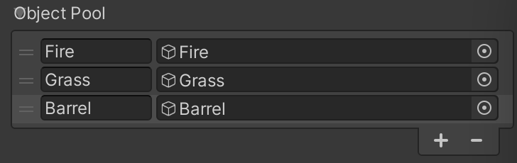

### PonderateRandom

Many games uses randomizer tweaked to let some elements happens more times than others.
It is called "ponderate randomisation". You can create your own by using `PonderateRandom`
class and add weight on each elements ; allowing some to happen more or less than others.

```csharp
using BaseTool;
using UnityEngine;

var cheatedDice = new PonderateRandom<string> {
    { "One", 1 },
    { "Two", 1 },
    { "Three", 0.5f }, // the three happens twice less than others
    { "Four", 1 },
    { "Five", 1 },
    { "Six", 2 }, // the six happens twice more than others
};

// use UnityEngine.Random
Debug.Log(cheatedDice.Get());

// use System.Random
var random = new System.Random(1);
Debug.Log(cheatedDice.Get(random)); // always be "Two"
Debug.Log(cheatedDice.Get(random)); // always be "One"
```

### Game Events

This feature allows you to create custom events using ScriptableObjects.

It is based upon three elements:
- `GameEvent` which is the ScriptableObject that handle the event channel ;
- `GameEventTrigger` which triggers the event on the channel ;
- `GameEventReceiver` which processes actions when the event is triggered in the channel.

What is the purpose of this architecture? Well, it allows you to trigger multiple actions from only one trigger.
For example: the player enters a zone of battle, it will close the door, spawn enemies and play the battle music.

Also, this is really useful for multi-scene game events. It is impossible to reference a gameobject from a scene to another.
That's why subscribing to a SO GameEvent speed up development and let you interoperate events between runtime loaded scenes.
For example: you have two loaded scenes in your level, the player passes a point that enables platforms in another scene.

You can totally inherit from those classes if you want to make custom game event, more specific or with alternate triggers.

#### `GameEvent`

In the Project window, right click in the folder you want to place the game event
and then follow `Create > BaseTool > Events > Game Event`.

#### `GameEventTrigger`

This is the component you should use to trigger game events.
It is recommended to use a `Collider` with this component because 
it depends on `OnTriggerEnter()` and/or `OnCollisionEnter()` Unity calls to work properly.

|Property|Type|Description|
|---|---|---|
|Trigger Once|`bool`|If checked, this component will trigger the event only once.|
|Trigger Type|`GameEventTriggerType`|How the game event will be processed: Trigger, Collision or both.|
|Trigger Tags|`List<string>`|List of authorized tags that will trigger the event.|
|Game Event|`GameEvent`|The game event SO to trigger (optional).|
|Generic Events|`UnityEvent`|Additional callbacks that you can use (optional).|

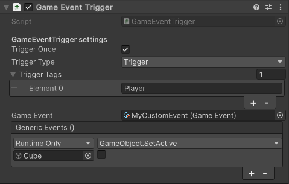

#### `GameEventReceiver`

This is the component you should use to process callbacks from a game event.
You can add it on any elements you want, as long as the objects is active 
(to allow event subscription in the `OnEnable()` method).

|Property|Type|Description|
|---|---|---|
|Game Event|`GameEvent`|The game event SO to listen to.|
|OnTriggered|`UnityEvent`|Additional callbacks that you can use (optional).|

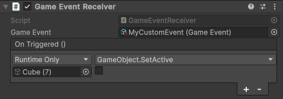

### Class Extensions

This package contains many class extensions for mainly Unity primary classes. Here are the current extensions:

- [Array Extensions](./Documentation~/Extensions.md#array-extensions)
- [Camera Extensions](./Documentation~/Extensions.md#camera-extensions)
- [Color Extensions](./Documentation~/Extensions.md#color-extensions)
- [List Extensions](./Documentation~/Extensions.md#list-extensions)
- [Number Extensions](./Documentation~/Extensions.md#number-extensions)
- [Random Extensions](./Documentation~/Extensions.md#random-extensions)
- [Range Extensions](./Documentation~/Extensions.md#range-extensions)
- [String Extensions](./Documentation~/Extensions.md#string-extensions)
- [Transform Extensions](./Documentation~/Extensions.md#transform-extensions)
- [Vector Extensions](./Documentation~/Extensions.md#vector-extensions)

Go to the full documentation : [Class Extensions](./Documentation~/Extensions.md)

### Math Utils

Methods available from the `MathUtils` static class:

#### `Modulo(int index, int count)`

Because `%` is broken on C# when you want to get a negative modulo (e.g. you want the index -1 of an array), this method is a replacement of the symbol. 

```csharp
using BaseTool; 

MathUtils.Modulo(1, 5); // = 1
MathUtils.Modulo(6, 5); // = 1
MathUtils.Modulo(-1, 5); // = 4
MathUtils.Modulo(-3, 5); // = 2
```

#### `Approximately(float a, float b, float tolerance = 0.001f)`

The [`UnityEngine.Mathf.Approximately`](https://docs.unity3d.com/ScriptReference/Mathf.Approximately.html)
method is useful but not enough tolerant if you want to check values that are too different.

For example: if you want to make a deadzone on your Vector3 magnitude when it goes lower than 0.01f, 
the `Mathf.Approximately(vector.magnitude, 0)` could return false if your magnitude is too high.

```csharp
using BaseTool; 

MathUtils.Approximately(0.1f, 0.001f); // true
MathUtils.Approximately(1, 0.001f); // false

MathUtils.Approximately(1.1f, 1.2f, 0.2f); // true
MathUtils.Approximately(1.1f, 1.2f, 0.05f); // false
```

### TickManager

The `TickManager` component allows you to create a system that sends a tick every *x* seconds.
You can define the delay between two ticks by modifying the `Tick Duration` field.
You can also make the `TickManager` a singleton by checking `Make Singleton` 
(it will convert it to a singleton at Awake, don't do that at runtime!).

To add the component, you can go to `Add Component > BaseTool > Core > Tick Manager`.
You can have more than one `TickManager` on a singleton GameObject, but it is highly recommended
to use only one `TickManager` (as singleton) or seperate them between multiple GameObjects.

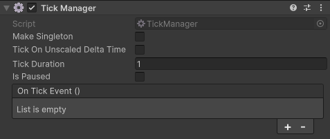

You can subscribe to the tick event from the inspector (using `UnityEvent`)
or the `OnTick` event action.

```csharp
using BaseTool;
using UnityEngine;

public class TickerTest : MonoBehaviour
{
    [SerializeField] private TickManager _tickManager;

    void Start()
    {
        _tickManager.OnTick += OnTick;
    }

    private void OnTick() => Debug.Log("OnTick()");
}
```

If you want to add more custom tick, you can create a struct that implements the `ICustomTick`
interface, and create you own tick logic. The interface implements the `ShouldTick(ulong tick)`
method where `tick` is the current number of ticks elapsed since the beginning of the game.

The following example shows how to create a custom tick that process every two ticks only:

```csharp
using BaseTool;
using UnityEngine;

public struct EveryTwoTicks : ICustomTick
{
    public bool ShouldTick(ulong tick) => tick % 2 == 0;
}

public class TickerTest : MonoBehaviour
{
    [SerializeField] private TickManager _tickManager;

    private void OnEnable()
    {
        _tickManager.RegisterCustomTick<EveryTwoTicks>(OnEveryTwoTicks);
    }

    private void OnDisable()
    {
        _tickManager.UnregisterCustomTick<EveryTwoTicks>(OnEveryTwoTicks);
    }

    private void EveryTwoTicks() => Debug.Log("EveryTwoTicks()");
}
```

### Tree

A generic tree system following a parent/child link. Here is a following example based on a GameObject hierarchy (but would work for a file, UI or node hierarchy too).

```csharp
using BaseTool;
using UnityEngine;

// Create a tree from a GameObject
Tree<GameObject> cameraTree = new(GameObject.Find("Camera"));
// Add a child to the camera tree
cameraTree.AddChild(GameObject.Find("WeaponRender"));

// Create a tree from a GameObject
Tree<GameObject> tree = new(GameObject.Find("Root"));
// Add a child from a GameObject
tree.AddChild(GameObject.Find("PlayerRender"));
// Add a tree to anothe tree
tree.AddChild(cameraTree);

tree.Parent; // = null
tree.Current; // = Root (GameObject)
cameraTree.Parent; // = tree (Tree<GameObject>)

foreach(Tree<GameObject> child in tree)
{
    child.Parent;
    child.Current;
    child.Children;
}
```

### <span id="core-interfaces">Interfaces</span>

#### `IDamageable`

Interface used to expose a component that can take damages (from a hit, an attack or a fall).

```csharp
public interface IDamageable
{
    public void TakeDamages(double damages);
}
```

## Movement

The `Movement` module contains most of components used for movement, jump, camera rotation.
You can enable it, if you want to create one of the following game archetype:

- FPS
- ~~TPS~~
- Platformer
- Arcade
- ~~Top-down~~
- ~~Twin-stick~~

By default, the `Movement` module is enabled but can be disabled in the [Setup Wizard](#setup-wizard).
This module is located under the `BaseTool.Movement` namespace.

### <span id="movement-components">Components</span>

#### `OldMovementInput`

If you are not using the new input system, you can add this component on your player to quickly
setup a player movement based on the old input system.

This component manages a `IMovable` and/or a `IJumpable` component ; if they are found, the inputs are processed and sent to the component.

#### `FirstPersonController`

This component manages a first-person view based on a GameObject/Camera hierarchy.
In this kind a architecture, the component is placed at the root of the player object hierarchy.
Then, the `Camera` is under, as a child. The `FirstPersonController` references the camera,
using `GetComponentInChildren` or referencing it from the inspector.

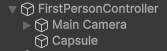

**Caution** : this component requires a `Rigidbody` to work properly and is **not** using the Unity `CharacterController`.

#### `SideViewController`

A light side-view controller. It only manages the movement of the object. The architecture is quite simple, you need to add this component on the element that can move, on its root (recommended).

#### `TopDownController`

This component is used to get a 2.5D-like movement (action-rpgs like Diablo, Torchlight, Minecraft Dungeons...). You must add the component on the player's root from 
`Add Component > BaseTool > Movement > Top Down Controller`.

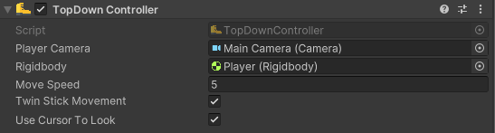

The camera **must** not be a child of the player ; you can use the `SimpleCameraController`
or [Cinemachine](https://docs.unity3d.com/Manual/com.unity.cinemachine.html) 
to follow the player.

#### `JumpController`

This component allows any object to jump, with a quick setup.

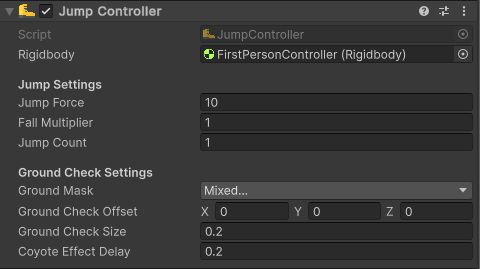

|Property|Description|
|---|---|
|Rigidbody|The `Rigidbody` of the jumpable element.|
|Jump Force|The velocity to apply when the element needs to jump.|
|Fall Multiplier|The velocity multiplier when the element is falling.|
|Jump Count|The number of allowed jumps.|
|Ground Mask|The `LayerMask` to check when the element touches the ground.|
|Ground Check Offset|The `Vector3` offset if your collision check is not on the ground.|
|Ground Check Size|The radius of the collision check.|
|Coyote Effect Delay|The delay of the coyote effect ; the time allowed to the element to jump even if it is not on the ground anymore.|

### <span id="movement-interfaces">Interfaces</span>

#### `IMovable`

This interface can be use to expose a component as a moving object. It is used to send movement inputs. See [`OldMovementInput`](#oldmovementinput) and [`FirstPersonController`](#firstpersoncontroller) for more information.

```csharp
public interface IMovable
{
    void Move(Vector2 move);

    void Rotate(Vector2 rotation);
}
```

#### `IJumpable`

This interface can be use to expose a component as a jumping object. It is used to send jump inputs. See [`OldMovementInput`](#oldmovementinput) and [`FirstPersonController`](#firstpersoncontroller) for more information.

```csharp
public interface IJumpable
{
    public bool CanJump { get; }

    public void Jump();
}
```

## Shooter

The `Shooter` module contains most of components used for weapons related games.
You can enable it, if you want to create one of the following game archetype:

- FPS
- TPS
- Arcade shooter
- Looter shooter
- RTS

By default, the `Shooter` module is enabled but can be disabled in the [Setup Wizard](#setup-wizard).
This module is located under the `BaseTool.Shooter` namespace.

### <span id="shooter-sample">Sample</span>

The package include a shooter sample project using most of the primary components to begin creating a FPS game.

### <span id="shooter-components">Components</span>

#### `OldShootInput`

Simple component that handles input (from the old input system) and calls `IShootable` shoot and reload
methods. It could be used with the [`ShootController`](#shootcontroller) component as well.

#### `ShootController`

This component can be added from the **AddComponent** menu by following `BaseTool > Shooter > Shoot Controller`. It implements `IShootable` and `IShootController` interfaces. 

It authorizes a GameObject to use a shoot logic and send shoot and reload informations to other components.

#### `WeaponController`

This component can be added from the **AddComponent** menu by following `BaseTool > Shooter > Weapon Controller`.

It is used to update, instantiate and swap weapons.

#### `WeaponSwitcher`

This component can be added from the **AddComponent** menu by following `BaseTool > Shooter > Weapon Switcher`.

#### `WeaponProjectile`

This component can be added from the **AddComponent** menu by following `BaseTool > Shooter > Weapon Projectile`.

It is used to add the projectile behaviour on a GameObject. This is for weapon purpose ; if a weapon must shoot projectiles instead of a raycast, the GameObject must have this component.

### <span id="shooter-interfaces">Interfaces</span>

#### `IShootable`

This interface must be used on a component that can shoot. E.g. the player or enemies. 
It forces the implementation of shooting and reloading method.

```csharp
public interface IShootable
{
    public bool CanShoot { get; }
    public void ShootPressed();
    public void ShootReleased();
    public void Reload();
}
```

#### `IShootController`

This interface must be used by a component that declares and exposes its shooting callbacks.
It is not mandatory but allows other components to understand that some logics could be executed
in the shoot process. For example, when you want a component that triggers animations when it shoots.

```csharp
public interface IShootController
{
    public event Action OnStartShoot;
    public event Action OnStopShoot;
    public event Action OnReload;
}
```

### Weapon

#### `Weapon`

This is the main object used for every weapons. You can create any type of weapon using this base.
To create a new one, right click in your project window, then `Create > BaseTool > Shooter > Weapon`.

#### `WeaponCategory`

This object refers to a category that could be assigned to a weapon. It is used to sort weapons or identify ammos. To create a new one, right click in your project window, then `Create > BaseTool > Shooter > Weapon Category`.

## RPG

[still in development]

## Roguelite

[still in development]

## UI

The `UI` module contains most of components used to manage user interfaces.
You can enable it, if you want to use a simple UI navigation workflow based on
parenthood views architecture. 

This module uses the `UnityEngine.UI` system and does not support 
`UnityEngine.UIElements` (UI Toolkit) yet.

By default, the `UI` module is enabled but can be disabled in the [Setup Wizard](#setup-wizard).
This module is located under the `BaseTool.UI` namespace.

### <span id="ui-workflow">Workflow</span>

The `UI` module follows [the official Unity UI recommendations](https://unity.com/fr/how-to/unity-ui-optimization-tips) about optimization and organization.
Meaning that you must setup a specific UI workflow to use the module:

1. Any view must inherit from the [`View`](#view) class ;
2. Each view must have a `Canvas` component ;
3. Views must be opened and closed using the `Navigation` class only ;
4. Sub-views must be children of a parent view in the Unity GameObject hierarchy ; and
5. Every view must be in the scene at start with its canvas disabled.

See the [sample](#ui-sample) for more examples.

### `View`

What is called a view is a page of an element that can be displayed or opened
by the user (like the inventory, settings, pause menu...). Any view created
must inherit from the `View` class that automatically registers the component
to the `Navigation`.

Caution: using UI GameObject that could be a view without inheriting from `View`
could broke the navigation workflow. 

You can create a view from the template by right click in your assets project :
`Create > BaseTool > UI > View Class`.

```csharp
using BaseTool.UI;

public class MyView : View
{
    // Called when the view is opened
    public override void OnNavigateFrom(View fromView, NavigationArgs args)
    {
        base.OnNavigateFrom(toView, args);
    }

    // Called when the view is closed
    public override void OnNavigateTo(View toView, NavigationArgs args)
    {
        base.OnNavigateTo(toView, args);
    }
}
```

|Methods and properties|Description|
|---|---|
|**Properties**|
|Tree|Get the full tree of the view, knowing its parent and its children.|
|Parent|Get the parent view (if it exists).|
|IsVisible|Returns true if the view is displayed (child or not).|
|**Methods**|
|`Display(boolean)`|Display (or hide) the view and its parent.|
|`OnNavigateFrom(View, NavigationArgs)`|Method called by the `Navigation` when the view is displayed (navigated from another view passed by parameter).|
|`OnNavigateTo(View, NavigationArgs)`|Method called by the `Navigation` when the view is closed (when navigation wants to open another view passed by parameter).|

### `Navigation`

The `Navigation` class **must be** the only way to display or hide views. This is
because it uses a navigation history to go backward. You can add the `BackBehaviour`
component anywhere in your scene to add this behaviour (or handle the back yourself).

|Methods|Description|
|---|---|
|`Open<View>()`|Open the view following the type in parameter.|
|`Close<View>()`|Close the view following the type in parameter.|
|`Back()`|Close the current view and open the previous one.|
|`Clear()`|Hide every views and clear the navigation history.|

The basic workflow, if you properly setup your views, is :

```csharp
using BaseTool.UI;

// View on the root UI
public class HomeView : View {}

// View on the root UI
public class SettingsView : View {}

// View inside the SettingsView
public class AudioSettingsView : View {}

Navigation.Open<HomeView>(); // will open the HomeView
Navigation.Open<SettingsView>(); // will open SettingsView

Navigation.Back(); // will close the SettingsView and open the HomeView

Navigation.Open<AudioSettingsView>(); // will open the AudioSettingsView

//will open the AudioSettingsView that is inside the SettingsView
Navigation.Open<SettingsView, AudioSettingsView>(); 
```

The `Open()` method can be used to open differents views. If you made a view
"unique", that only exists once, you can use the `Navigation.Open<T>()` method.
But, if the view you want to open exists multiple times, and could be different
depending on the context, you can open the view by a path search using two generics:
`Navigation.Open<T1, T2>()` ; like the example in the code upper.

You can also pass arguments when you want to open the view. Arguments will be sent
to the `OnNavigateTo()` on the closing view and `OnNavigateFrom()` on the opening view.

```csharp
using BaseTool.UI;

public class UserArgs : NavigationArgs
{
    public string Email;
    public string Password;
}

public class UserView : View 
{
    public override void OnNavigateFrom(View fromView, NavigationArgs args)
    {
        if(args is UserArgs userArgs)
        {
            ConnectToServer(userArgs.Email, userArgs.Password);
        }
    }

    private void ConnectToServer(string user, string pass)
    {
        // do something with data
    }
}
```

### <span id="ui-sample">Sample</span>

The package include a UI sample project that contains scripts to understand the
navigation workflow.

You can download it from the package manager, in the BaseTool sample tab. 

## Editor

### Misc Buttons

The package contains useful buttons/links directly accesible from the `Window` menu.
Here are their functions:

- `Window > BaseTool > Documentation` will open the documentation ;
- `Window > BaseTool > Report a bug...` will redirect you to the [issue](https://github.com/DarkRewar/BaseTool/issues) page ;
- `Window > BaseTool > Open Data Folder` will open the `Application.dataPath` in the Explorer/Finder ;
- `Window > BaseTool > Open Persistent Data Folder` will open the `Application.persistentDataPath` in the Explorer/Finder.

### Todo List

If you go to `Window > BaseTool > Todo List`, you can get an editor window that opens.
It will list you every TODO and FIXME entries found in your project.

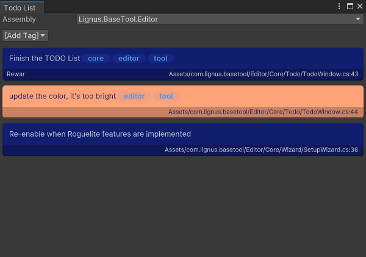

Entries are grouped by assemblies and can be filtered by tags. You can also by developpers to entries.
How does it work? In your C# script, inside your project, you can add todo and fixme comments. The tool
will detect them and add them to the list. To add some, you must follow those rules:

- start by a comment and a todo, fix or fixme : `//Todo`, `//Fix` or `//Fixme` ;
- (optionnal) you can add meta data between parenthesis:
    - if it begins by `@`, it will be detected as a dev name ;
    - if it begins by `#`, it will be detected as a tag to filter entries ;
- (optionnal) you can add `:` to seperate the begin of comment and content ;
- end with the message of the todo/fix you want to display.

You can see some following examples:

```csharp
//TODO a normal todo
//todo can be case insensitive
//Todo(@MyDeveloperName) : you can add names and punctation
//Todo(@MyName #core #engine #gameplay) : you can also add tags to filter entries
//Fixme : will be displayed
//Fix works like fixme
```

### `MinMaxAttribute`

This attribute allows you to put a slider range for a value in the inspector. It is used to create a range using `Vector2`.

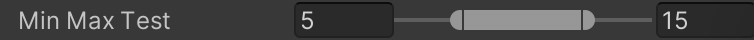

```csharp
using BaseTool;
using UnityEngine;

public class MyClass : MonoBehaviour
{
    [MinMax(0, 20)]
    public Vector2 MinMaxTest = new(5, 15);

    public bool IsValueInRange(float value) => 
        value.IsBetween(MinMaxTest.x, MinMaxTest.y);
}
```

### `IfAttribute`

This attribute can display its property from inspector only if condition is checked.

```csharp
using BaseTool;
using UnityEngine;

public class MyClass : MonoBehaviour
{
    public bool UseProjectile = true;

    [If(nameof(UseProjectile))]
    public GameObject ProjectilePrefab;

    public float ProjectileSpeed = 1f;
    
    [If("ProjectileSpeed > 1")]
    public GameObject ProjectileFX;
}
```

### `IfNotAttribute`

This attribute can hide its property from inspector only if condition is checked.

```csharp
using BaseTool;
using UnityEngine;

public class MyClass : MonoBehaviour
{
    public bool UseRaycast = true;

    [IfNot(nameof(UseRaycast))]
    public GameObject ProjectilePrefab;

    public float ProjectileSpeed = 1f;
    
    [If("ProjectileSpeed > 1")]
    public GameObject ProjectileFX;
}
```

### `ReadOnlyAttribute`

This attribute can mark the field or property as disabled in inspector (unchangeable).

```csharp
using BaseTool;
using UnityEngine;

public class MyClass : MonoBehaviour
{
    [ReadOnly]
    public int Lifepoints = 10;
}
```

### `MessageAttribute`

You can add a `[Message]` attribute before a field to display a message in the inspector.
You need to pass the message as the first parameter, and you can precise which type of message
you want (None, Info, Warning or Error).

```csharp
[MessageAttribute(string message, MessageAttribute.MessageType type = MessageAttribute.MessageType.Info)]
```

There also is three shortcut to write those messages: 
`InfoMessage`, `WarningMessage` and `ErrorMessage`.

```csharp
using BaseTool;
using UnityEngine;

public class MyClass : MonoBehaviour
{
    [Message("This is a normal message")]
    public float _hello;

    [WarningMessage("This is a warning message")]
    public float _helloWarning;

    [Message("This is an error message", MessageAttribute.MessageType.Error)]
    public float _helloError;
}
```

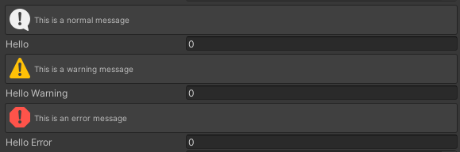

### `ButtonAttribute`

You can add a `[Button]` attribute before a method to display a button in the inspector.
When clicked, it will execute the method linked to the button attribute.

```csharp
using BaseTool;
using UnityEngine;

public class ButtonTest : MonoBehaviour
{
    [Button]
    public void DoSomething()
    {
        Debug.Log("Method called from inspector");
    }
}
```

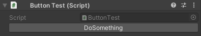